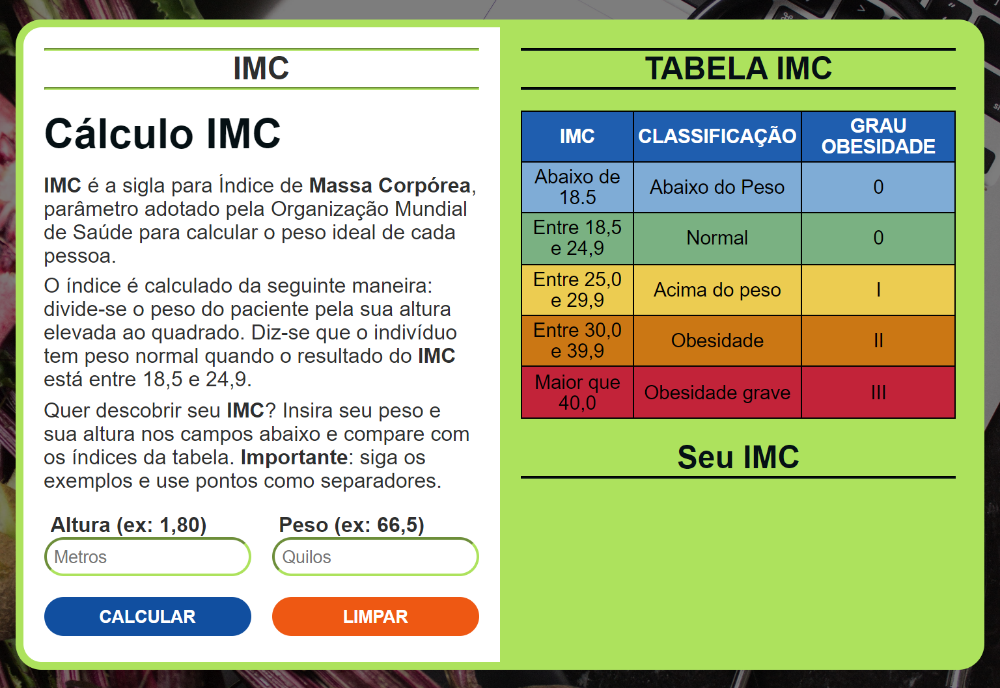

# Calculadora IMC
A calculadora IMC (índice de massa corporal) é um projeto que permite aos usuários calcular seu IMC a partir de sua altura e peso. O IMC é uma medida usada para avaliar se uma pessoa está com o peso adequado para sua altura. É calculado dividindo o peso (em quilogramas) pela altura (em metros) ao quadrado. A partir do resultado, é possível determinar se a pessoa está abaixo do peso, no peso ideal, com sobrepeso ou obesa.

# Link para visualização do projeto
## https://gilecampos.github.io/calc-imc/

# Tecnologias Usadas:
- HTML
- CSS 
- JavaScript
- Git e Github

# Aprendizado
Este projeto de calculadora IMC foi uma ótima oportunidade para desenvolver habilidades em JavaScript, especificamente na programação de lógica e manipulação de DOM. Aprendeu-se a trabalhar com elementos HTML e CSS usando JavaScript, o que permitiu aplicar estilos e alterar dinamicamente o conteúdo da página. Além disso, organizar as funções de forma eficiente e clara (ainda dá pra melhorar, como iniciante estou bem satisfeito), tornou-se uma habilidade importante para garantir que o código fosse fácil de entender e manter. Este projeto foi um passo importante na minha jornada de aprendizado de programação e espera-se continuar aplicando e aperfeiçoando essas habilidades em projetos futuros.

# Imagem projeto Desktop

# Features a adicionar.
## - Link com uma page interna, com dicas de como chegar ao IMC(peso ideal).
## - Responsividade para todos os dispositivos (disponivel somente em desktop por enquanto).

